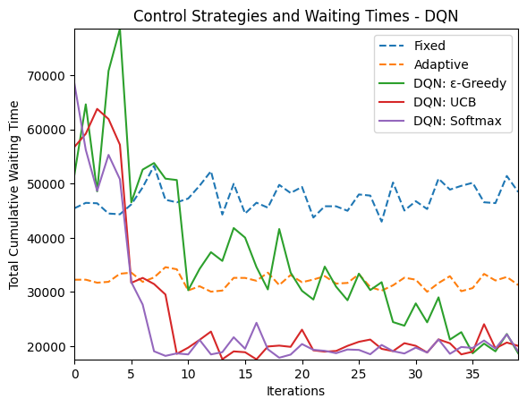

# A1

## Q1 Agent
Signal Controller

## Q2 Environment
SUMO

## Q3/4 MDP
MDP can be represented by the tuple $(S,A,R,T)$ - States, Actions, Reward, Transition Model

### State
$$
s \in S_{ped} \times S_{veh}
$$

$$
S_{ped} = S_{veh} = \{0, ..., 9\}
$$

A state is a tuple $(s_{ped}, s_{veh})$ which represents the number of peds
and vehicles respectively.
In training, one-hot encoding representation is used.

* Q: Why values $\geq 9$ lumped together?
* A: From real data, $s_{ped}, s_{veh} \geq 9$ is rare.

### Action
2 actions - {Pedestrian Green, Vehicle Green}

* Q: Can timing of light change be included in action?
* A: Yes. This will cause the action space to grow as well.

### Reward
Total Cummulative Wait Time (TCWT)

$$
TCWT = \sum p_{ped} + p_{veh}
$$

$$
R_t = TCWT_{t-1} - TCWT_t
$$

Reward is the decrease in TCWT between time steps.s

### Transition Model
Unknown, simulated by SUMO.

## Q5 Experiment Design
Hyperparameters

$$
\alpha = 0.001, \gamma = 0.95, E = 1000
$$

* Q: Were the hyperparameters tuned?
* A: Yes

Testing with 2 different environment settings
- Moderate pedestrian, low vehicle
- Moderate pedestrian, moderate vehicle

* Q: Why these settings? What about other settings?
* A: Other settings not tested yet, can be explored.

Compare with baseline controls
1. Fixed time control
2. Actuated pedestrian control

## Q6 Why DQN? 
Is DQN necessary given state representation? (no)

DQN is used when the state space is big, 
to generalize training on a small subset of the state space, to the entire space.

No, DQN is unnecessary, since there are only 100 possible states, with 2 possible actions.
This gives a total of 200 values in the Q-value table, 
corresponding to all state-action pairs.

Q-Learning can be used, and more actions can be added.

## Tasks
- [x] Setup SUMO
- [x] Briefly read `traci`
- [x] Read 2.2.3 Dissertation on Control Types
- [x] Implement Fixed Time Control
- [x] Report Fixed Time Control results
- [x] Replicate DQN result
  - [x] Implement GPU with CUDA
- [x] Increase flow settings
  - [x] e.g. high pedestrian, high vehicle
- [x] Report results of designs with figures

* Q: How is the vehicle arrival rate configured?
* A: In `pedcrossing.rou.xml`.

## Installing CUDA

Prerequisite: `conda`, NVIDIA GPU

Follow [installation guide](https://docs.nvidia.com/cuda/cuda-installation-guide-microsoft-windows/index.html).

1. Create conda environment.
    ```bash
    conda create --name sumo python=3.9
    conda activate sumo
    ```
1. Install `cudatoolkit`
    ```bash
    conda install -c conda-forge cudatoolkit cudnn
    ```
1. Install `tensorflow`
    ```bash
    pip install tensorflow tensorflow-gpu
    ```
    
# A2

## Q1 Experience Replay

Used to stabilise training, with more efficient use of previous experience.
Reduces noise and variance in training, converges better.

## Q2 $\epsilon$-greedy Policy

Covers the exploration-exploitation trade-off in RL.
Choose the greedy action with probability $1-\epsilon$,
and a random action with probability $\epsilon$.
Greedy action is chosen in the final model.

$\epsilon\in[0,1]$, higher values correspond to more explorative behaviour, lower values correspond to more exploitative behaviour. Can be lowered over time like in $\epsilon=1/t$ to eventually be optimal in greedy behaviour.

In the paper, $\epsilon$ is linearly annealed over time as follows.

$$
\epsilon = 1 - \frac{e}{E},
$$

where e is the current episode, and E is the total number of episodes trained.

## Q3 Other Policies

### Exploration Function
Use exploration function $r^+$ with bonus $\mathcal{B}$
where $N(s)$ is the number of times state s is visited in the episode.

$$
r^+(s, a) = r(s,a) + \mathcal{B}(N(s))
$$ 

and take 

$$
a=\arg\max_a r^+(s,a)
$$

UCB sets

$$
\mathcal{B}(N(s))=\sqrt{\frac{2\ln n}{N(s)}}
$$

### Softmax Policy
Use softmax policy, given the Q-value function $Q_\theta(s,a)$

$$
\pi_\theta(s,a)=\frac{\exp Q_\theta(s,a)}{\sum_{a'}\exp Q_\theta(s,a')}
$$

Sample action $a\sim\pi_\theta(s,a)$.

## Q4 Pedestrian/Vehicle Arrival

Number of pedestrians at each time step modelled as binomial distribution, 
with a maximum number n, and probability p of each pedestrian appearing.

Number of vehicles at each time step modelled as Poisson distribution, 
with arrival rate $\lambda$.

Moderate pedestrians setting has $n=5,p=1/6$.
Moderate vehicles setting has $\lambda=0.35/s$

## Q5 LQR or Deep RL?

LQR is model-based RL. 
It requires the dynamics of the environment to be known.

Deep RL is typically model-free, where the transition model of the environment is unknown.

## Q6 Optimizers

Optimizers and their hyperparameters
* SGD - Learning Rate, Momentum, Nesterov
* Adam - Learning Rate, $\beta_1, \beta_2$

Default SGD sets `momentum=0, nesterov=False`.
AdaGrad is Adam with $\beta_1=\beta_2=0$.

## Tasks

- [x] Replicate results & figures
- [x] Smart Control Strategy for Traffic Signal
- [ ] Prepare 20 slides - <20 words per slide
  - [ ] Problem statement
- [ ] Future Directions
- [ ] LQR Analytical Solution

## Misc

* [nuPlan Challenge](https://www.nuscenes.org/nuplan#challenge)
* [Jieping Ye](https://scholar.google.com/citations?user=T9AzhwcAAAAJ&hl=en) - Ride-Hailing RL

# Policy Results

The plot below shows the TCWT over iterations from Fixed, Adaptive, and RL-trained Controls. Both tabular and Deep RL were investigated, and made use of the 3 types of policy choices in training.




It can be seen that using the softmax and exploration policy choices 
converge more quickly than $\epsilon$-greedy.
This could be attributed to the linear annealing being done on $\epsilon$
slowing convergence to the more optimal greedy policy.

Q-Table also performs much faster than DQN, taking 0.06s per iteration compared to 15s. 
This is as expected, since the neural network takes computation time, 
as opposed to the TD equation used for tabular learning.
